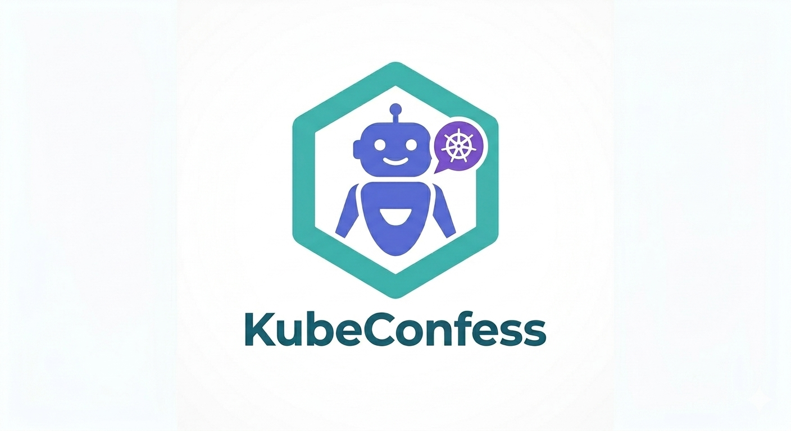

 

# KubeConfess: AI-Powered Kubernetes Security Agent

**KubeConfess** is an open-source conversational AI agent for Kubernetes security. Instead of memorising `kubectl` flags and piping output through `jq`, you simply describe what you want — and the agent figures out which API calls to make, executes them against your live cluster, and explains what it found.

## What you will learn

In this lab you will:

- Install KubeConfess and connect it to a live Kubernetes cluster
- Use the conversational interface to list workloads and scan for misconfigurations
- Analyse RBAC bindings to identify over-privileged service accounts
- Run **Investigate Mode** to automatically map full attack paths from a target
- Exec into a compromised pod and run KubeConfess in **In-Cluster Mode** for post-exploitation reconnaissance

## Lab environment

Two namespaces are being deployed in the background while you read this:

| Namespace | Purpose |
|---|---|
| `kubeconfess-audit` | Listing, security scanning, RBAC analysis |
| `kubeconfess-attack` | In-cluster mode, investigate mode, attack capabilities |

Both contain realistic misconfigurations — privileged pods, secrets in env vars, over-privileged service accounts, and static SA tokens. These are intentionally vulnerable for learning purposes.

> **Note:** The environment is being set up now. By the time you reach Step 1, everything will be ready.

## Prerequisites

- Basic familiarity with Kubernetes concepts (pods, namespaces, RBAC)
- An API key from [console.anthropic.com](https://console.anthropic.com) (free tier is sufficient)

---

Click **START** when you are ready.
